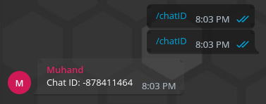
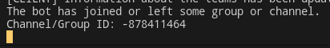

# basic.json setup guide
To get started, open the [basic.json](../src/config/basic.json) file located in the [src/config/](../src/config/) directory.
## Properties Help
- `DisableRootVerification` - A property that disables the check to launch a bot not from the root directory. It is recommended not to touch these properties.
- `attachedImage` - This property indicates whether the user needs to attach an image when writing a review. The value `false` will allow the user not to attach the image.
- `minimumNumberOfCharactersInAReview` - The minimum number of characters for a review.
- `maximumNumberOfCharactersInAReview` - The maximum number of characters for a review.
- `chatIdWithReviews` - ID of the chat to which the feedback message will be forwarded. The value `null` says that the bot will not forward the message to the chat.
- `channelIdWithReviews` - ID of the channel to which the user's feedback will be forwarded.
- `userCooldown` - By default, a review can be written once every 24 hours. Thanks to this setting, you can change this behavior. The value is set in milliseconds, so to allow you to publish news every minute, you need to set the value to 1000 * 60, that is, `60000` milliseconds. A value of `0` allows you to accept feedback as much as you want, and a value of `null` prohibits sending feedback a second time.
## How do I find out Chat ID and Channel ID?
It's simple! Launch the bot and invite it to a chat or channel. The information you need will be displayed in the console.
If you have invited a bot to the chat, you can also register the command `/chatId`



# Configuring the display of commands
Go to the file [src/config/commandsInfo.ts](../src/config/commandsInfo.ts). Just below you will see a diagram of the commands:
```ts
start: {
  show: true,
  shortDescription: 'Start over.'
},
chatID: {
  show: false,
  shortDescription: 'Find out the group ID.'
}
```
- `start`, `chatID` - the names of the commands.
- The `show` parameter is responsible for displaying the command in the Telegram. If the value is false, the command will not be offered to the user.
- The `shortDescription` parameter is responsible for a brief description of the command that the user sees when calling it. **Please don't leave this line blank!!**
