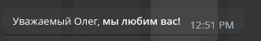

# Руководство по изменению языковых файлов
Все языковые файлы хранятся в папке [src/contents/](../../src/contents/)
## Максимальная длина различных текстов.
- Кнопки могут содержать в себе максимум 120 символов, но мы рекомендуем делать названия как можно более короткими.
- Максимальная длина сообщений - 4000 символов.
- Максимальная длина всплывающих ответов при нажатии на кнопку - 60 символов, но мы рекомендуем не превышать порог в 30-40 символов.

## Процесс редактирования.
Возьмём для примера файл [src/contents/commands/start/welcome_1.dialogue.ts](../../src/contents/commands/start/welcome_1.dialogue.ts). В каждом файле вы можете найти комментарий, для чего отвечает данный диалог и когда он используется.

### Поддержка HTML-стиля.
Вы можете применять к своему тексту различные HTML теги, это официально поддерживается Telegram.
К примеру вы можете сделать свой текст **жирным**, применив к нему тег `<b>`:
```ts
const dialogue: MultilingualDialogues = {
  RU: 'Уважаемый пользователь, <b>мы любим вас!</b>'
}
```
Более подробную информацию вы можете почитать [здесь](https://core.telegram.org/bots/api#html-style). **Будьте внимательны, не закрытый тег или неправильно поставленные символы разметки может привести к поломке бота!**

### Символ `'`
Если вам нужно поставить символ `'`, вы столкнётесь с такой синтаксической ошибкой:
```ts
const dialogue: MultilingualDialogues = {
  EN: 'Wow, it's beautiful here!'
}
```
Обойти это можно просто добавив перед `'` символ `\`:
```ts
const dialogue: MultilingualDialogues = {
  EN: 'Wow, it\'s beautiful here!'
}
```
### Различные `{теги}`
При написании диалогов, вам, возможно, потребуется нечто большее. Например обращение к пользователю по его имени или юзернейму. Как раз здесь на помощь приходят `{теги}`. Всего их 4 (в некоторых файлах их может быть чуть-чуть больше):
- `{usernameOrName}` - Отображает @username или имя пользователя.
- `{usernameOrFullName}` - Отображает @username или полное имя пользователя с фамилией.
- `{lastName}` - Просто отображает имя пользователя.
- `{fullName}` - Отображает имя и фамилию.

Почему нет тега `{username}`? Мы не можем гарантировать, что у всех пользователей в Telegram есть @username, поэтому вынуждены сделать так. 

Примеры использования тегов: 
```ts
const dialogue: MultilingualDialogues = {
  RU: 'Уважаемый {lastName}, <b>мы любим вас!</b>'
}
```


## Проверка всех диалогов.
Чтобы проверить все диалоги, введите команду: `yarn run dialogueTest`. Тестирование проверит, чтобы диалоги не выходили за максимальную длину и не имели пустых строк.

---
> Вернутся к [README.md](./README.md)