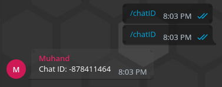
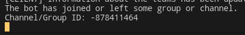
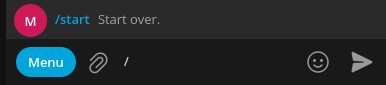

# Гайд по настройке basic.json 
Чтобы начать, откройте файл [basic.json](../../src/config/basic.json), находящийся в директории [src/config/](../../src/config/)
## Справка по параметрам
- `DisableRootVerification` - Свойство, которое отключает проверку запуска бота из корневого каталога. Рекомендуется не прикасаться к этому свойству.
- `attachedImage` - Это свойство указывает, нужно ли пользователю прикреплять изображение при написании отзыва. Значение `false` позволит пользователю не прикреплять изображение.
- `minimumNumberOfCharactersInAReview` - Минимальное количество символов для отзыва.
- `maximumNumberOfCharactersInAReview` - Максимальное количество символов для отзыва.
- `chatIdWithReviews` - ID чата, куда будет переслан отзыв пользователя. Значение `null` говорит о том, что бот не будет пересылать сообщение в чат.
- `channelIdWithReviews` - ID канала, в который будет пересылаться отзывы пользователей.
- `userCooldown` - По умолчанию отзыв может быть написан один раз в 24 часа. Благодаря этому параметру вы можете изменить это поведение. Значение задается в миллисекундах, поэтому, чтобы вы могли публиковать новости каждую минуту, вам нужно установить значение 1000 * 60, то есть `60000` миллисекунд. Значение `0` позволяет вам принимать отзывы столько, сколько вы хотите, а значение `null` запрещает отправку отзывов во второй раз.
## Как мне получить Chat ID и Channel ID?
Это просто! Запустите бота и пригласите его в чат или канал. Необходимая вам информация будет отображена в консоли.
Если вы пригласили бота в чат, вы также можете прописать команду `/chatId`



# Настройка отображения команд
Перейдите в файл [src/config/commandsInfo.ts](../../src/config/commandsInfo.ts). Чуть ниже вы увидите вот такую схему команд:
```ts
start: {
  show: true,
  shortDescription: 'Start over.'
},
chatID: {
  show: false,
  shortDescription: 'Find out the group ID.'
}
```
- `start`, `chatID` - названия команд.
- Параметр `show` отвечает за отображение команды в Telegram. Если значение равно `false` - команда не будет предложена пользователю.
- Параметр `shortDescription` отвечает за краткое описание команды, который пользователь видит при её написании. **Пожалуйста, не оставляйте эту строку пустой!!**



---
> Вернутся к [README.md](./README.md)